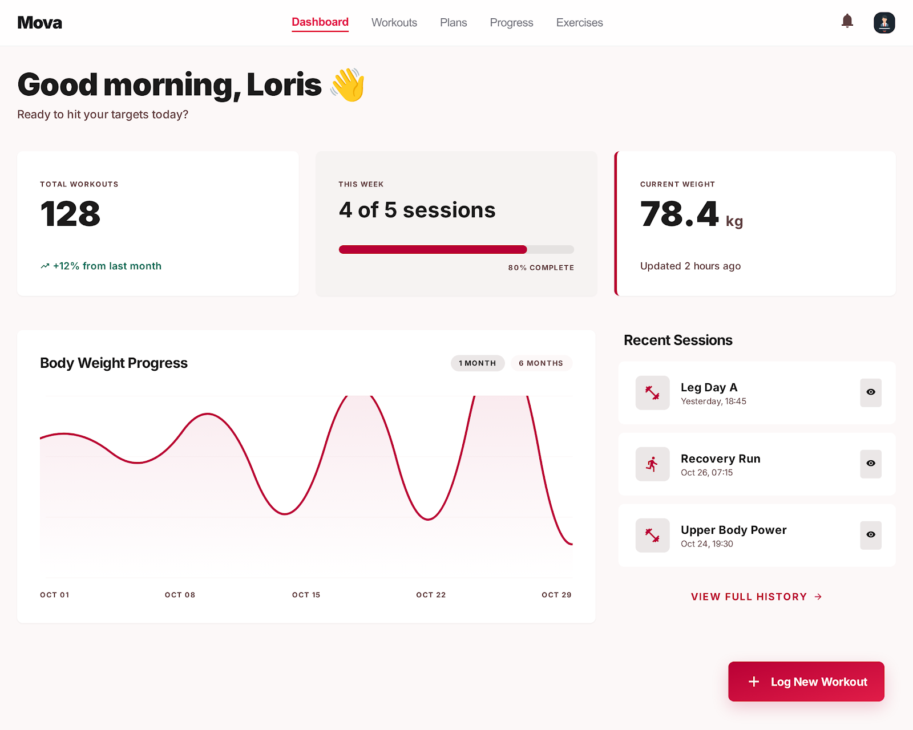
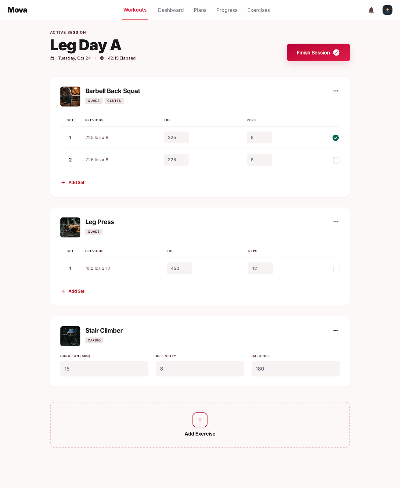
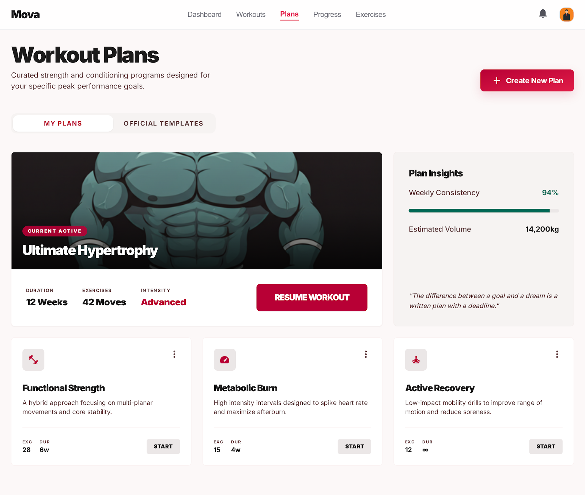
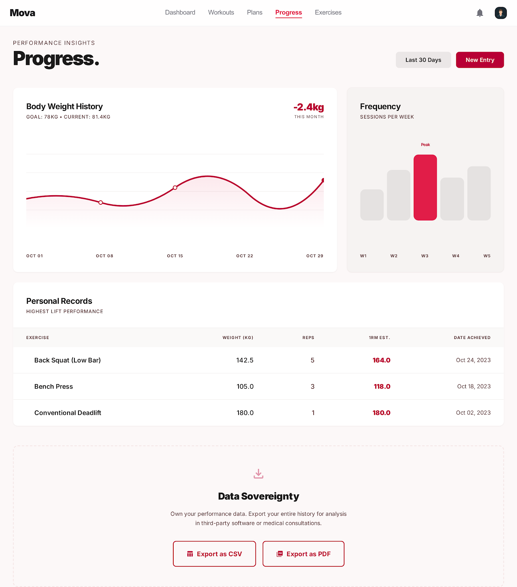
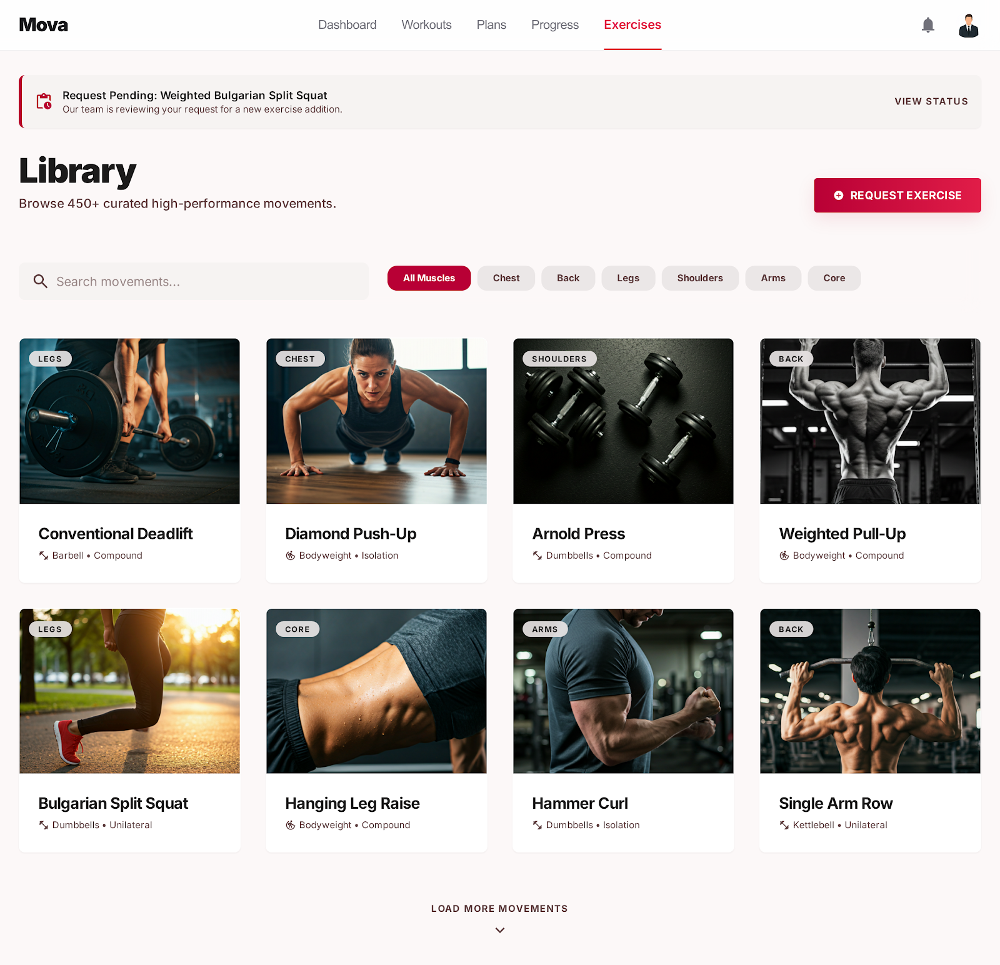
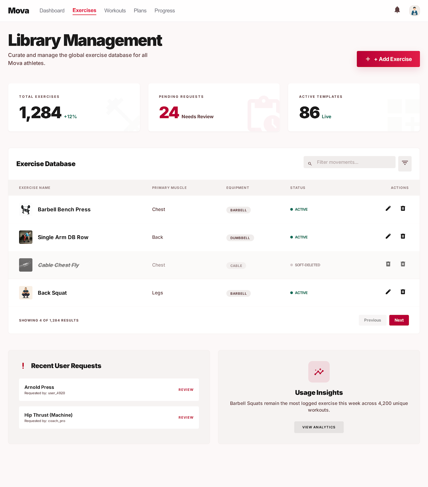

# Gym Tracker Project

## Project Description

The Gym Tracker (Mova) is a comprehensive web application designed to help fitness enthusiasts log their workouts, track their body metrics, and follow structured training plans. To maintain data consistency, only an Administrator can manage the master list of available exercises. Users can utilize Admin-created templates, save their own custom workout plans, log daily sessions (manual weightlifting and cardio entries), track progress, and export their historical data.

---

## Analysis

### Scenario

A fitness enthusiast wants a single app to plan, log, and review every gym session. They need to:
- Browse a curated master list of exercises maintained by an Admin
- Build and save their own custom workout plans or use Admin-provided templates
- Log each gym session by recording sets, reps, weight, or cardio duration
- Track body weight over time and export all data as CSV or PDF
- Request new exercises to be added to the platform if their preferred movement is missing

An Admin manages the platform's integrity: creating and maintaining the exercise master list, approving or denying user exercise requests, and managing standardized workout templates.

---

### User Stories

**Admin**

1. As an Admin, I want to have a responsive web app so I can comfortably manage the platform on mobile devices while walking the gym floor, or on a desktop computer.
2. As an Admin, I want to see a consistent visual appearance to navigate the backend easily without confusion.
3. As an Admin, I want to use list views to explore the master database of exercises, review user-submitted exercise requests, and manage standardized workout templates (e.g., "Beginner Leg Day").
4. As an Admin, I want to use edit and create views to add new exercises (specifying targeted muscle groups), approve/deny user requests, and maintain the platform's business data.
5. As an Admin, I want to log in securely so that I can authenticate myself and ensure only authorized staff can alter the master exercise database.

**User**

1. As a User, I want to use list views on public pages to browse available workout templates and the master exercise list before I commit to a workout.
2. As a User, I want to authenticate myself so that I can access my private dashboard, log my personal workout sessions, and track my confidential body metrics.
3. As a User, I want to track my progress over time and export my logged data (workouts and body metrics) into a PDF or CSV file for personal record-keeping or sharing with a coach.
4. As a User, I want to save my own customized workout routines based on the master exercise list, so I don't have to rebuild my workout from scratch every time.
5. As a User, I want to be able to request a new exercise to be added to the platform, so that I can track specific movements not currently in the master list.

---

### Use Cases

| ID | Title | Actor | Description |
|----|-------|-------|-------------|
| UC-1 | Manage Master Exercises | Admin | Admin can create, read, update, and soft-delete exercises from the master database. |
| UC-2 | Manage Plans & Templates | Admin & User | Admin can bundle exercises into reusable workout templates. Users can also save custom workout routines to their personal profiles. |
| UC-3 | Log Workout | User | User can select a template or build a session from the master exercise list, manually logging weightlifting (reps/weight) or cardio (duration/distance). |
| UC-4 | Track & Export Progress | User | User can view historical data of their logged workouts and body metrics, and export this data as CSV/PDF. |
| UC-5 | Request Exercises | User | User can submit a request for a new exercise, which the Admin can review and approve. |

---

## Design

### Domain Design

Our domain model is organized into **4 subdomains** following Domain-Driven Design (DDD) principles. Each subdomain contains one or more **Aggregates**, which are clusters of domain objects treated as a single unit of consistency.

#### Subdomains & Aggregates

**Subdomain: Workout Logging (Core)**
This is the heart of the application — the primary reason Mova exists. It is served by the **Workout Service**.

- **WorkoutSession Aggregate**
  - `WorkoutSession` *(Aggregate Root)*: Represents one gym visit. Holds the date, the owning user, and an optional reference to the plan that was followed.
  - `WorkoutSet` *(Child Entity)*: Represents one individual set performed inside a session (exercise performed, reps, weight, or cardio duration). Cannot exist without its parent session.

- **WorkoutPlan Aggregate**
  - `WorkoutPlan` *(Aggregate Root)*: A reusable, named workout template (e.g., "Leg Day A"). Can be created by an Admin as a global template or by a User as a personal routine.
  - `PlanExercise` *(Child Entity)*: One exercise slot inside a plan. Stores which exercise, in which order, and with which target sets/reps. Cannot exist without its parent plan. Resolves the N:M relationship between `WorkoutPlan` and `Exercise` while carrying real business attributes (order, targets).

**Subdomain: Exercise Management (Supporting)**
Manages the master exercise catalogue and the exercise request lifecycle. Served by the **Exercise Service**.

- **Exercise Aggregate**
  - `Exercise` *(Aggregate Root)*: The master definition of a movement (name, muscle group, cardio flag, active flag). Strictly managed by Admin. Soft-deleted to preserve historical workout data.

- **ExerciseRequest Aggregate**
  - `ExerciseRequest` *(Aggregate Root)*: A user's submission to request a new exercise be added to the master list. Has its own lifecycle (PENDING → APPROVED / DENIED). On approval, the Admin creates a new `Exercise` record.

**Subdomain: Progress Tracking (Supporting)**
Tracks body composition data over time. Served by the **Metrics Service**.

- **BodyMetric Aggregate**
  - `BodyMetric` *(Aggregate Root)*: A single body weight measurement on a specific date, belonging to one user.

**Subdomain: User Management (Generic)**
Handles authentication and identity. Served by the **User Service**. Classified as Generic because this capability could be sourced from an off-the-shelf solution.

- **User Aggregate**
  - `User` *(Aggregate Root)*: The authenticated actor. Holds credentials and a role (Admin or User). Owns all sessions, plans, metrics, and exercise requests.

---

#### Domain Model Entities

| Entity | Type | Aggregate | Attributes |
|--------|------|-----------|------------|
| `User` | Aggregate Root | User | id, username, password (hashed), role: Admin\|User [VO] |
| `Exercise` | Aggregate Root | Exercise | id, name, muscle_group, is_cardio, is_active |
| `ExerciseRequest` | Aggregate Root | ExerciseRequest | id, user_id, suggested_name, muscle_group, status: Enum [VO] |
| `WorkoutPlan` | Aggregate Root | WorkoutPlan | id, name, creator_id, is_template |
| `PlanExercise` | Child Entity | WorkoutPlan | id, plan_id, exercise_id, order_index, target_sets, target_reps |
| `WorkoutSession` | Aggregate Root | WorkoutSession | id, date, user_id, plan_id (nullable) |
| `WorkoutSet` | Child Entity | WorkoutSession | id, session_id, exercise_id, reps [VO], weight [VO], duration [VO] |
| `BodyMetric` | Aggregate Root | BodyMetric | id, user_id, date, body_weight [VO] |

*[VO] = Value Object: a field whose identity is defined by its value, not by a database ID.*

---

#### Relationships

| Relationship | Crow's Foot Notation | Rule |
|---|---|---|
| `User` → `WorkoutSession` | One and Only One to Zero or Many | A user can have zero or many sessions |
| `User` → `WorkoutPlan` | One and Only One to Zero or Many | A user can own zero or many plans |
| `User` → `BodyMetric` | One and Only One to Zero or Many | A user can log zero or many body metrics |
| `User` → `ExerciseRequest` | One and Only One to Zero or Many | A user can submit zero or many requests (max 5 pending — enforced in backend) |
| `WorkoutSession` → `WorkoutSet` | One and Only One to One or More | A session must contain at least one set (Business Rule 3) |
| `WorkoutSession` → `WorkoutPlan` | Zero or Many to Zero or One | A session can optionally follow a plan; a user can train freestyle |
| `WorkoutPlan` → `PlanExercise` | One and Only One to One or More | A plan must contain at least one exercise slot |
| `PlanExercise` → `Exercise` | Zero or Many to One and Only One | Each slot references exactly one master exercise |
| `WorkoutSet` → `Exercise` | Zero or Many to One and Only One | Each set records exactly one exercise performed |

---

### UI Mockups

The following screens were designed using Google Stitch following shadcn/ui design principles with a clean, minimal aesthetic and red (#E11D48) as the accent color.

| Screen | Description |
|--------|-------------|
|  | **User Dashboard** — Stats, body weight chart, recent sessions |
|  | **Workout Logger** — Active session with sets, reps and weight |
|  | **Workout Plan Detail** — Plan overview with exercise order and targets |
|  | **Progress & Export** — Charts, personal records, CSV/PDF export |
|  | **Exercise Library** — Master list with filters and request form |
|  | **Admin Dashboard** — Exercise management table |

---

### Business Rules

The following strict business rules are enforced in the backend:

- **Rule 1 — Exercise Authority Integrity:** Users cannot create custom exercises on the fly — they must select from the Admin's master list. If an Admin deletes an exercise, it is only *soft-deleted* (marked as `is_active = false`). It becomes unavailable for future workouts but remains visible in users' past logs so historical data is preserved.
- **Rule 2 — Anti-Spam Security:** To prevent database spam, a standard User can only have a maximum of **5 Pending** exercise requests in the system at any given time.
- **Rule 3 — Data Validation:** A `WorkoutSession` cannot be saved unless it contains at least one completed `WorkoutSet`.

---

## Implementation

### Backend Technology

> **Note:** Following a discussion with and approval from our lecturer, our backend will be implemented using Python (e.g., FastAPI/Flask) rather than the default Spring Boot/Java stack.

This web application relies on:
- **Python (FastAPI/Flask)** for the backend service layer
- **SQLite or PostgreSQL** for the relational database management
- **OpenAPI 3.0 / Swagger** for API endpoint documentation

### Frontend Technology

The front-end will be developed using a low-code approach via **Budibase** to ensure a responsive layout across desktop and mobile devices.

---

## Project Management

### Team Roles

> **Note:** As beginners, we are utilizing a highly collaborative, cross-functional approach where all team members share responsibilities across the stack.

- **Loris** — Cross-Functional Full-Stack Developer
- **Patrick** — Cross-Functional Full-Stack Developer
- **Nico** — Cross-Functional Full-Stack Developer

### Milestones

| # | Milestone | Status |
|---|-----------|--------|
| 1 | Analysis: Scenario ideation, use case analysis and user story writing | ✅ Completed |
| 2 | Domain Design: Definition of domain model | ✅ Completed |
| 3 | Frontend Implementation: Design, prototyping and realization of frontend functionality | 🔄 In Progress |
| 4 | Business Logic and API Design: Definition of business logic and API | 🔄 In Progress |
| 5 | Data and API Implementation: Implementation of data access and business logic layers and API | ⏳ Pending |
| 6 | Security: Implementation of API-level security (Basic Auth) | ⏳ Pending |
| 7 | Demonstrator: Integration of frontend and backend to realize an end-to-end application | ⏳ Pending |
