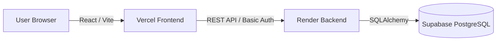

# 🏋️ Mova — Gym Tracker

> A full-stack web application for planning, logging, and reviewing gym workouts.

[](https://mova-lake.vercel.app)
[](https://mova-backend-05ic.onrender.com/docs)
[](https://www.python.org/)
[](https://react.dev/)

---

## Table of Contents

- [Overview](#overview)
- [Features](#features)
- [Tech Stack](#tech-stack)
- [Architecture](#architecture)
- [Getting Started](#getting-started)
- [Environment Variables](#environment-variables)
- [Project Structure](#project-structure)
- [Documentation](#documentation)
- [Domain Model](#domain-model)
- [Business Rules](#business-rules)
- [API Documentation](#api-documentation)
- [Deployment](#deployment)
- [Presentation Video](#presentation-video)
- [Team](#team)
- [Milestones](#milestones)
- [License](#license)

---

## Overview

**Mova** is a gym tracking web application built for the _Internet Technology_ module at FHNW. It enables fitness enthusiasts to browse a curated exercise catalogue, build custom workout plans, log gym sessions with detailed set data, track body weight over time, and export historical data as CSV or PDF.

The platform implements **role-based access control** with two roles:

| Role | Capabilities |
|------|-------------|
| **Admin** | Manage the master exercise catalogue, review user-submitted exercise requests, create global workout templates |
| **User** | Browse exercises, build personal workout plans, log sessions, track body metrics, export data, request new exercises |

---

## Features

- **Exercise Library** — Admin-managed master catalogue with muscle-group filtering and search
- **Exercise Requests** — Users can suggest new exercises; Admins approve or deny (max 5 pending per user)
- **Workout Plans** — Reusable templates (Admin) and personal routines (User) with ordered exercise slots
- **Workout Logger** — Log freestyle or plan-based sessions with strength (reps × weight) and cardio (duration) sets
- **Body Metrics** — Track body weight over time with date-based entries
- **Progress Dashboard** — At-a-glance stats, body weight chart, and recent session history
- **Data Export** — Download workout history and body metrics as CSV or PDF
- **Authentication** — HTTP Basic Auth with secure password hashing (bcrypt)
- **Responsive UI** — Mobile-first design built with shadcn/ui and Tailwind CSS

---

## Tech Stack

### Backend

| Technology | Purpose |
|-----------|---------|
| [FastAPI](https://fastapi.tiangolo.com/) | Web framework & REST API |
| [SQLAlchemy](https://www.sqlalchemy.org/) | ORM & database access |
| [Alembic](https://alembic.sqlalchemy.org/) | Database migrations |
| [Pydantic](https://docs.pydantic.dev/) | Data validation & serialization |
| [PostgreSQL](https://www.postgresql.org/) | Production database (via Supabase) |

### Frontend

| Technology | Purpose |
|-----------|---------|
| [React 19](https://react.dev/) | UI library |
| [TypeScript](https://www.typescriptlang.org/) | Static typing |
| [Vite](https://vite.dev/) | Build tool & dev server |
| [Tailwind CSS 4](https://tailwindcss.com/) | Utility-first styling |
| [shadcn/ui](https://ui.shadcn.com/) | Accessible UI components |
| [TanStack Query 5](https://tanstack.com/query) | Data fetching & caching |
| [React Router 7](https://reactrouter.com/) | Client-side routing |
| [Zod](https://zod.dev/) | Schema validation |
| [Recharts](https://recharts.org/) | Data visualization |

---

## Architecture

Mova follows a clean client–server architecture with strict separation of concerns.



> **Rule:** The frontend never connects directly to the database. All data access, authentication, and business logic is handled by the FastAPI backend.

For a detailed breakdown, see [docs/architecture.md](docs/architecture.md).

---

## Getting Started

### Prerequisites

- **Python 3.11** — Backend runtime
- **Node.js 20+** — Frontend tooling
- **Git** — Version control

### 1. Clone the repository

```bash
git clone https://github.com/SbaaLoris/GymTracker.git
cd GymTracker
```

### 2. Backend setup

```bash
# Create and activate a virtual environment
python3.11 -m venv .venv
source .venv/bin/activate   # Windows: .venv\Scripts\activate

# Install dependencies
pip install -r backend/requirements.txt

# Configure local development
export MOVA_DEV_MODE=1
export MOVA_SEED_DEMO_USERS=1
export MOVA_SEED_STARTER_DATA=1

# Run database migrations
cd backend && alembic upgrade head && cd ..

# Start the API server
uvicorn backend.main:app --reload
```

The API will be available at `http://localhost:8000`. Interactive docs at `http://localhost:8000/docs`.

### 3. Frontend setup

```bash
cd frontend

# Install dependencies
npm install

# Configure the API endpoint
echo "VITE_API_URL=http://localhost:8000" > .env

# Start the dev server
npm run dev
```

The app will be available at `http://localhost:5173`.

---

## Environment Variables

### Backend

| Variable | Default | Description |
|----------|---------|-------------|
| `DATABASE_URL` | `sqlite:///./mova.db` | Database connection string. If unset, the app exits unless `MOVA_DEV_MODE=1`. |
| `MOVA_DEV_MODE` | `0` | Set to `1` to allow local SQLite databases. |
| `MOVA_CORS_ORIGINS` | `http://localhost:5173,http://localhost:3000` | Comma-separated list of allowed CORS origins. |
| `MOVA_BOOTSTRAP_ADMIN_USERNAME` | — | Username for the initial admin account. |
| `MOVA_BOOTSTRAP_ADMIN_PASSWORD` | — | Password for the initial admin account. |
| `MOVA_SEED_DEMO_USERS` | `0` | Set to `1` to seed demo user accounts and body metrics. |
| `MOVA_SEED_STARTER_DATA` | `0` | Set to `1` to seed 15 starter exercises and a beginner template. |

### Frontend

| Variable | Default | Description |
|----------|---------|-------------|
| `VITE_API_URL` | — | Backend API base URL. Baked into the build at compile time. |

---

## Project Structure

```
GymTracker/
├── backend/
│   ├── alembic/            # Database migration scripts
│   ├── models/             # SQLAlchemy ORM models
│   ├── routers/            # FastAPI route handlers
│   ├── schemas/            # Pydantic request/response schemas
│   ├── services/           # Business logic layer
│   ├── tests/              # Integration tests
│   ├── auth.py             # Authentication helpers
│   ├── database.py         # DB engine, session, and seeding
│   ├── main.py             # Application entry point
│   └── requirements.txt    # Python dependencies
├── frontend/
│   └── src/
│       ├── api/            # API client & endpoint functions
│       ├── auth/           # Auth context & route guards
│       ├── components/     # Reusable UI components (+ shadcn/ui primitives)
│       ├── hooks/          # TanStack Query data hooks
│       ├── lib/            # Utilities, constants, formatters
│       ├── pages/          # Top-level route components
│       ├── schemas/        # Zod validation schemas
│       ├── App.tsx          # Application shell & routing
│       └── main.tsx         # React entry point
├── docs/
│   ├── adr/                # Architecture Decision Records (ADRs 0001 - 0015)
│   ├── architecture.md     # Architecture overview
│   ├── database.md         # Database schema, engines, and seeding
│   ├── decisions.md        # Architecture Decisions index page
│   ├── deployment.md       # Production deployment guide
│   ├── openapi.yaml        # OpenAPI 3.0 specification
│   ├── security.md         # Security, authentication, and CORS
│   ├── testing.md          # Multi-tier validation and integration test runner
│   └── DDD Mova.png        # Domain model diagram
└── README.md
```

---

## Documentation

To assist reviewers, developers, and team members in auditing or extending the system, Mova includes a comprehensive, production-grade documentation suite:

- **[Architecture Decisions (ADR Index)](docs/decisions.md)** — Access detailed design, hosting, framework, security, and interface decision records (0001 to 0015).
- **[Database Architecture](docs/database.md)** — In-depth details on SQLAlchemy models, engine connectivity adapters, SQLite pragma enforcements, soft-delete engines, and seeding systems.
- **[Security & Authentication](docs/security.md)** — Explanations of HTTP Basic Auth flow, bcrypt timing-safe password hashing, permission-based role gating, and cross-origin (CORS) security guidelines.
- **[Verification & Testing](docs/testing.md)** — Guide on multi-tier schema checks (Zod / Pydantic v2) and full execution instructions for the custom shell integration test runner (`integration_test.sh`).

---

## Domain Model

The domain is organized into **four subdomains** following Domain-Driven Design (DDD) principles.


| Subdomain | Aggregate Roots | Description |
|-----------|----------------|-------------|
| **Workout Logging** _(Core)_ | `WorkoutSession`, `WorkoutPlan` | Session logging with sets; reusable plans with exercise slots |
| **Exercise Management** _(Supporting)_ | `Exercise`, `ExerciseRequest` | Master catalogue and user suggestion lifecycle |
| **Progress Tracking** _(Supporting)_ | `BodyMetric` | Body weight measurements over time |
| **User Management** _(Generic)_ | `User` | Authentication, identity, and role assignment |

<details>
<summary><strong>Entity Reference Table</strong></summary>

| Entity | Type | Aggregate | Key Attributes |
|--------|------|-----------|----------------|
| `User` | Aggregate Root | User | id, username, password (hashed), role |
| `Exercise` | Aggregate Root | Exercise | id, name, muscle_group, is_cardio, is_active |
| `ExerciseRequest` | Aggregate Root | ExerciseRequest | id, user_id, suggested_name, muscle_group, status |
| `WorkoutPlan` | Aggregate Root | WorkoutPlan | id, name, creator_id, is_template |
| `PlanExercise` | Child Entity | WorkoutPlan | id, plan_id, exercise_id, order_index, target_sets, target_reps |
| `WorkoutSession` | Aggregate Root | WorkoutSession | id, date, user_id, plan_id (nullable) |
| `WorkoutSet` | Child Entity | WorkoutSession | id, session_id, exercise_id, reps, weight, duration |
| `BodyMetric` | Aggregate Root | BodyMetric | id, user_id, date, body_weight |

</details>

<details>
<summary><strong>Relationship Table</strong></summary>

| Relationship | Cardinality | Rule |
|---|---|---|
| `User` → `WorkoutSession` | 1:0..* | A user can have zero or many sessions |
| `User` → `WorkoutPlan` | 1:0..* | A user can own zero or many plans |
| `User` → `BodyMetric` | 1:0..* | A user can log zero or many body metrics |
| `User` → `ExerciseRequest` | 1:0..* | A user can submit zero or many requests (max 5 pending) |
| `WorkoutSession` → `WorkoutSet` | 1:1..* | A session must contain at least one set |
| `WorkoutSession` → `WorkoutPlan` | 0..*:0..1 | A session can optionally follow a plan |
| `WorkoutPlan` → `PlanExercise` | 1:1..* | A plan must contain at least one exercise slot |
| `PlanExercise` → `Exercise` | 0..*:1 | Each slot references exactly one master exercise |
| `WorkoutSet` → `Exercise` | 0..*:1 | Each set records exactly one exercise performed |

</details>

---

## Business Rules

| # | Rule | Enforcement |
|---|------|-------------|
| 1 | **Exercise Authority** — Users must select from the Admin's master list. Deleted exercises are soft-deleted (`is_active = false`) to preserve historical data. | Backend |
| 2 | **Anti-Spam** — A user can have at most **5 pending** exercise requests at any time. | Backend |
| 3 | **Data Integrity** — A `WorkoutSession` cannot be saved without at least one `WorkoutSet`. | Backend |

---

## API Documentation

The full REST API is defined in the [OpenAPI 3.0 specification](docs/openapi.yaml).

**Interactive documentation** is available at:
- **Local:** http://localhost:8000/docs
- **Production:** https://mova-backend-05ic.onrender.com/docs

### API Endpoints Overview

| Tag | Endpoints | Description |
|-----|-----------|-------------|
| Auth | `POST /auth/register`, `GET /auth/me` | Registration and authentication |
| Exercises | `GET/POST /exercises`, `GET/PUT/DELETE /exercises/{id}` | Master exercise catalogue (Admin-managed) |
| Exercise Requests | `GET/POST /exercise-requests`, `POST .../approve`, `POST .../deny` | User exercise suggestions |
| Workout Plans | `GET/POST /workout-plans`, `GET/PUT/DELETE /workout-plans/{id}` | Templates and personal routines |
| Workout Sessions | `GET/POST /users/{id}/workout-sessions`, `GET/PUT/DELETE .../sessions/{id}` | Logged gym sessions |
| Body Metrics | `GET/POST /users/{id}/body-metrics`, `GET/PUT/DELETE .../body-metrics/{id}` | Body weight tracking |
| Export | `GET /users/{id}/export/csv`, `GET /users/{id}/export/pdf` | Data export |

---

## Deployment

| Component | Provider | URL |
|-----------|----------|-----|
| Frontend | Vercel | [mova-lake.vercel.app](https://mova-lake.vercel.app) |
| Backend | Render | [mova-backend-05ic.onrender.com](https://mova-backend-05ic.onrender.com) |
| Database | Supabase | PostgreSQL (private) |
| Keep-alive | cron-job.org | Pings `/health` every 15 min |

For the complete production deployment guide, see [docs/deployment.md](docs/deployment.md).

---

## Presentation Video

Presentation Video: To be added before Moodle submission.

---

## Team

> **Internet Technology** module — FHNW School of Business

| Name | Role |
|------|------|
| Loris | Full-Stack Developer |
| Patrick | Full-Stack Developer |
| Nico | Full-Stack Developer |
| Walther | Full-Stack Developer |

---

## Milestones

| # | Milestone | Status |
|---|-----------|--------|
| 1 | Analysis — Scenario ideation, use cases, user stories | ✅ Completed |
| 2 | Domain Design — Domain model definition | ✅ Completed |
| 3 | Frontend — Design, prototyping, and implementation | ✅ Completed |
| 4 | Business Logic & API Design — API specification | ✅ Completed |
| 5 | Data & API Implementation — Backend development | ✅ Completed |
| 6 | Security — HTTP Basic Auth implementation | ✅ Completed |
| 7 | Demonstrator — End-to-end integration | ✅ Completed |

---

## License

This project was created for educational purposes as part of the Internet Technology module at FHNW.
