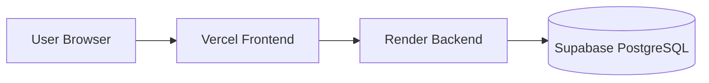

# ADR 0004: Separate Frontend, Backend, and Database

## Status

Accepted

## Context

Mova is a full-stack web application with a React frontend, a FastAPI backend, and a PostgreSQL database.

The team wanted a clear architecture with separated responsibilities. The frontend should handle the user interface, the backend should handle authentication, authorization, business rules, and API logic, and the database should only be accessed through the backend.

## Decision

We decided to use a three-part architecture:

The frontend does not connect directly to the database. All database access happens through the FastAPI backend.

## Reasons

This architecture was selected because it provides:

- Clear separation of responsibilities
- A controlled API layer between frontend and database
- Centralized business logic in the backend
- Better security because database credentials are not exposed to the frontend
- Better scalability and maintainability
- A structure that follows common client-server best practices

## Alternatives Considered

Possible alternatives would have included:

- A monolithic deployment with frontend, backend, and database tightly coupled
- Direct frontend access to Supabase (bypassing the custom backend API)
- Hosting frontend and backend on the same provider
- Using a Backend-as-a-Service approach without a custom FastAPI backend

These alternatives were not selected because the team wanted to keep business logic, authentication, and database access inside the backend.

## Consequences

### Positive

- The architecture is easier to understand and document.
- Each component has a clear responsibility.
- The backend protects the database from direct frontend access.
- The system can be deployed and updated component by component.
- The architecture is closer to a real-world production setup.

### Negative

- Deployment is slightly more complex because three services must be configured.
- Environment variables must be managed across multiple platforms.
- Debugging may require checking Vercel, Render, and Supabase separately.
