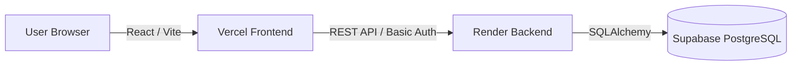

# Architecture Documentation

This document describes the high-level architecture, technology stack, and organizational principles of the **Mova Gym Tracker**.

## System Overview

Mova is built as a modern web application with a clear separation between frontend and backend.

---

## Technology Stack

### Backend (Python)
- **FastAPI**: High-performance web framework for the API.
- **SQLAlchemy**: ORM for database interaction.
- **Alembic**: Database migration tool.
- **Pydantic**: Data validation and serialization.

### Frontend (TypeScript / React)
- **Vite**: Next-generation frontend tooling.
- **React 19**: UI library for component-based development.
- **TypeScript**: Static typing for reliability.
- **Tailwind CSS 4**: Utility-first CSS framework.
- **shadcn/ui**: High-quality, accessible UI components.
- **React Router 7**: Client-side navigation.
- **TanStack Query 5**: Data-fetching, caching, and state synchronization.
- **Zod**: Schema validation (Pydantic equivalent for TypeScript).

---

## Project Structure

### Frontend (`/frontend/src`)

The frontend follows a feature-oriented structure designed for scalability:

| Directory | Purpose |
|---|---|
| `api/` | API client logic, `apiFetch` wrapper, and endpoint-specific calls. |
| `auth/` | Authentication context, login logic, and protected routes. |
| `components/` | Reusable UI components. `ui/` contains shadcn primitives. |
| `hooks/` | Custom hooks and TanStack Query data hooks (e.g., `useExercises`). |
| `pages/` | Top-level screen components corresponding to routes. |
| `schemas/` | Zod schemas defining data structures and validation. |
| `types/` | Global TypeScript type definitions. |
| `lib/` | Shared utilities (e.g., formatting, constants). |

### Mapping to Backend

To maintain consistency, frontend modules map directly to backend concepts:

| Backend | Frontend | Responsibility |
|---|---|---|
| `models/` | `schemas/` + `types/` | Data structure definition |
| `schemas/` | `schemas/` | Validation & Serialization |
| `services/` | `hooks/` + `api/` | Business Logic |
| `routers/` | `pages/` | Entry points and routing |
| `exceptions.py` | `api/client.ts` | Error handling |

---

## Authentication Flow

Mova uses **HTTP Basic Authentication**.

1. **Login**: User enters credentials in `LoginPage`.
2. **Context**: `AuthContext` stores the encoded credentials in `sessionStorage`.
3. **API Calls**: The `apiFetch` wrapper automatically adds the `Authorization: Basic ...` header to every request if credentials exist.
4. **Validation**: The backend validates the header against the database.
5. **Persistence**: On refresh, `AuthContext` initializes from `sessionStorage` to keep the user logged in.

---

## Development Principles

- **Surgical Changes**: We follow the **Karpathy Guidelines**—touch only what is necessary and maintain consistency.
- **Types First**: Always define TypeScript interfaces and Zod schemas before building UI.
- **Clean API Layer**: Never use `fetch()` directly in components; always use the `api/` layer and TanStack Query hooks.
- **Responsive Design**: All UI components are built mobile-first using Tailwind CSS.
