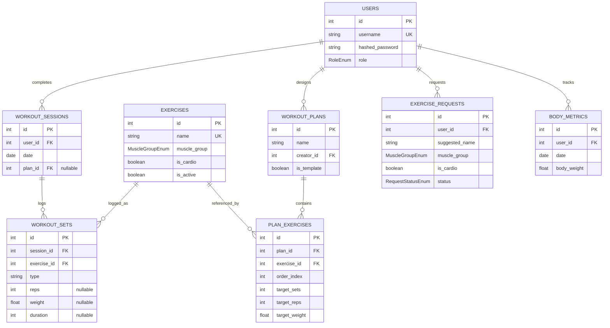

# Database Documentation

This document covers the **Mova Gym Tracker** database architecture, SQLAlchemy models, relationships, migration pipelines, and seeding systems.

---

## 1. Engine and Connection Adapters

The database is built on **SQLAlchemy ORM** and configured to support **PostgreSQL** in production (Supabase PaaS) and **SQLite** for lightweight local testing. 

### Production PostgreSQL Handling
Render injects the `DATABASE_URL` environment variable using the deprecated `postgres://` prefix. Because SQLAlchemy 2.x standardizes on the `postgresql://` prefix and throws an error if `postgres://` is used, the connection layer dynamically parses the URL on startup:
```python
db_url = os.environ.get("DATABASE_URL")
if db_url and db_url.startswith("postgres://"):
    db_url = db_url.replace("postgres://", "postgresql://", 1)
```

### Local SQLite Fallback & Safety Constraints
To avoid accidentally spinning up an ephemeral SQLite database in production due to a missing environment variable, local SQLite is gated behind the `MOVA_DEV_MODE=1` environment variable. If `DATABASE_URL` is empty and `MOVA_DEV_MODE` is not enabled, the backend aborts startup:
```python
is_dev = os.environ.get("MOVA_DEV_MODE", "0") == "1"
if not db_url:
    if is_dev:
        db_url = f"sqlite:///{os.path.join(project_root, 'mova.db')}"
    else:
        print("ERROR: DATABASE_URL is not set and MOVA_DEV_MODE is not 1. Aborting startup...")
        sys.exit(1)
```

### SQLite Foreign Key Enforcement
By default, SQLite does not enforce foreign key constraints. We explicitly register an event listener on the connection pool to enforce references:
```python
if db_url.startswith("sqlite"):
    @event.listens_for(engine, "connect")
    def set_sqlite_pragma(dbapi_connection, connection_record):
        cursor = dbapi_connection.cursor()
        cursor.execute("PRAGMA foreign_keys=ON")
        cursor.close()
```

---

## 2. ORM Model Reference

Mova implements the following entity relationships in `backend/models/`:



### Key Models & Properties

#### 1. User ([user.py](file:///Users/lorissbaa/Desktop/GymTracker/backend/models/user.py))
- `username`: String(50), Unique, Indexed.
- `role`: SQLAlchemy Enum mapping to `RoleEnum` (`admin` or `user`).

#### 2. BodyMetric ([body_metric.py](file:///Users/lorissbaa/Desktop/GymTracker/backend/models/body_metric.py))
- Enforces a unique composite constraint `uq_body_metric_user_date` on `(user_id, date)`. This prevents duplicate weight entries for a user on the same calendar day.

#### 3. Exercise ([exercise.py](file:///Users/lorissbaa/Desktop/GymTracker/backend/models/exercise.py))
- `name`: String(100), Case-insensitive Unique Index using standard lowercase conversion `func.lower('name')`.
- `muscle_group`: Enum representing focus area (Chest, Back, Legs, etc.).
- `is_active`: Boolean flag supporting soft-deletes.

#### 4. ExerciseRequest ([exercise_request.py](file:///Users/lorissbaa/Desktop/GymTracker/backend/models/exercise_request.py))
- `status`: Enum containing `pending`, `approved`, or `denied`.
- Users submit requests, and only an admin user can flag them as approved or denied. Once approved, the backend automatically spawns the respective global exercise.

#### 5. WorkoutPlan ([workout_plan.py](file:///Users/lorissbaa/Desktop/GymTracker/backend/models/workout_plan.py))
- Represents workout split configs.
- `is_template`: Identifies standard global plans designed by an admin (available to everyone for copying/use) versus custom user plans.
- Contains a cascade delete orphan mapping to `PlanExercise`.

#### 6. WorkoutSession ([workout_session.py](file:///Users/lorissbaa/Desktop/GymTracker/backend/models/workout_session.py))
- Captures workout days. Gathers multiple logs (`WorkoutSet`) mapping back to active users and optional starting `WorkoutPlan`.

---

## 3. Soft Delete Engine

To maintain structural integrity for historical exercises that are referenced in user logs and plan presets, exercises are never physically purged via `DELETE` statements.

### Soft-Delete Flags
Instead, when an exercise is deleted in the admin interface, `is_active` is toggled to `False`.

### Backend Query Restrictions
The backend excludes inactive exercises from selectors and active lists while still allowing historical logs to fetch the inactive exercise record for accurate dashboard displays.
```python
# Query active exercises
active_exercises = db.query(Exercise).filter(Exercise.is_active == True).all()
```

---

## 4. Initial Bootstrap and Seeding System

Mova includes an automated system to seed database records. The seeding logic is strictly idempotent and controlled by environment flags.

### 1. Admin Bootstrapping
On application initialization, the system reads two environment variables:
- `MOVA_BOOTSTRAP_ADMIN_USERNAME`
- `MOVA_BOOTSTRAP_ADMIN_PASSWORD`

If both exist and no admin user is in the database yet, it automatically registers the credentials and sets the role to `admin` using a secure bcrypt hash:
```python
admin_exists = db.query(User).filter(User.role == RoleEnum.ADMIN).first() is not None
if not admin_exists:
    admin = User(
        username=admin_username,
        hashed_password=hash_password(admin_password),
        role=RoleEnum.ADMIN
    )
    db.add(admin)
    db.commit()
```

### 2. Demo User and Metric Seeding
If `MOVA_SEED_DEMO_USERS=1` is configured, Mova checks if the `users` table is empty and populates standard demo users along with weight metrics:
- Admin Account: `nicokoechli` (password: `12345678`)
- User Account: `lorissbaa` (password: `12345678`)
- User Account: `patrickzobrist` (password: `12345678`)
- Multi-week body weight progress measurements are generated for the primary admin user to populate dashboard weight graphs immediately.

### 3. Core Muscle Exercises and Template Seeding
If `MOVA_SEED_STARTER_DATA=1` is configured, Mova populates:
- **15 Standard Exercises**: Covering Chest, Back, Legs, Shoulders, Arms, Core, and Cardio muscle groups.
- **Full Body Beginner Workout Plan Template**: Pre-populated with classic exercises (Bench Press, Barbell Squat, Pull-Up), standard target rep ranges, and initial working weights.

---

## 5. Schema Migration (Alembic)

Database schema updates are handled via versioned migration files in the `backend/alembic/` directory.

- **Creating a Migration**:
  ```bash
  alembic revision --autogenerate -m "description_of_change"
  ```
- **Executing Migrations**:
  ```bash
  alembic upgrade head
  ```
- **Production Migrations**: Automatic schema migrations are executed during backend startup on Render prior to the server opening connection listeners.
